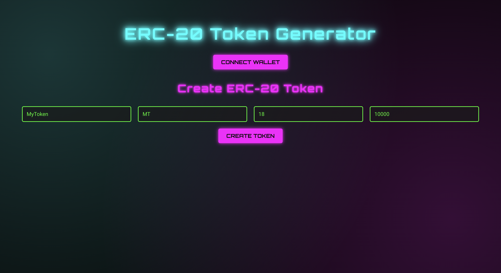

# ERC-20 Token Generator

This project is to help people create ERC-20 token with single click using web-based wallet (e.g. Metamask)



## Play dApp locally

Install dependencies then run dApp, dApp will be hosted on http://localhost:3000/

```bash
npm install && npm start
```

Connect wallet -> Input token metadata -> Click `CREATE TOKEN` button and have fun :rocket:
